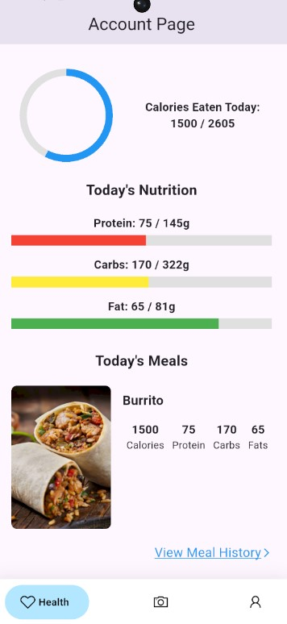
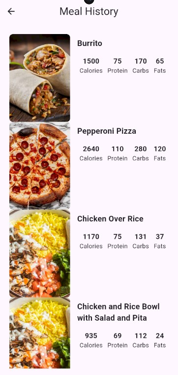
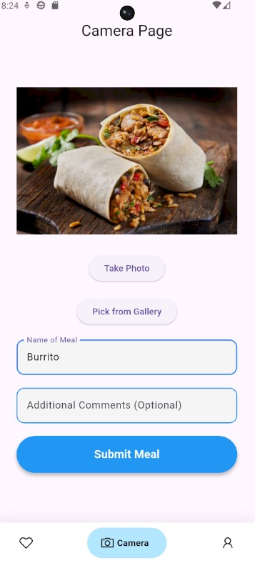
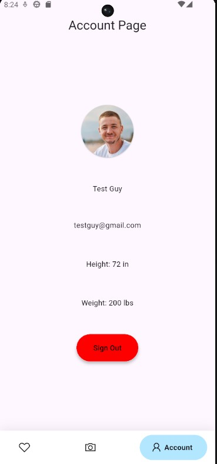

# Forkcast

Forkcast is a nutrition tracking app that lets users:
- Log meals using AI-powered image analysis
- Track daily calories and macronutrients against personalized targets
- Manage basic profile data (height, weight, age, sex) and automatically recalculate daily macros
- Review meal history and see daily summaries of intake

User authentication and data persistence are handled via Firebase, and all nutrition data is stored per-user in Firestore.

---

# Tech Stack, Libraries, and Tools

- **Flutter**: Cross‑platform UI framework used to build the app for mobile devices.
- **Firebase Core (`firebase_core`)**: Initializes and connects the app to Firebase.
- **Firebase Auth (`firebase_auth`)**: Email/password authentication, session management, and auth state stream (`authStateChanges`).
- **Cloud Firestore (`cloud_firestore`)**: Stores user profiles, macro targets, and meal logs (including per‑meal nutrition and timestamps).
- **Firebase Storage (`firebase_storage`)**: Stores meal images and user profile pictures.
- **Google Generative AI (`google_generative_ai`)**: Analyzes meal images and returns estimated calories and macronutrients as structured JSON.
- **Image Picker (`image_picker`)**: Lets users select images from the gallery (e.g., for profile pictures).
- **Camera MacOS (`camera_macos`)**: Camera support for compatible platforms.

Navigation is driven by a simple `AuthGate` that routes authenticated users into the main `Navigation` scaffold (Health, Camera, Account) and unauthenticated users to the splash/login/signup flow.

---

# App Screenshots

### Splash Page

Home screen of the app that welcomes users giving the option to sign up or log in

### Health Page

Shows all of the daily health information of the user such as daily calories and macronutrients for seamless tracking

### Meals Page

Page that displays every meal that the user has tracked through the app

### Camera Page

Allows the user to take a photo of their meal or upload a photo of the meal and submit it for calorie tracking

### Account Page

Page that displays user information and allows user to change their height and weight by tapping on the text field

